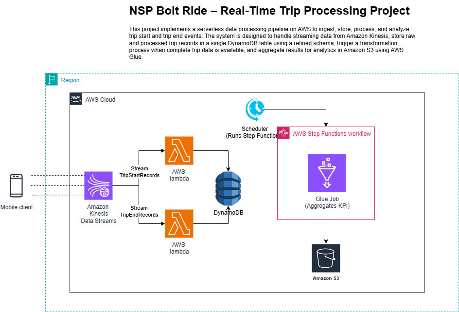
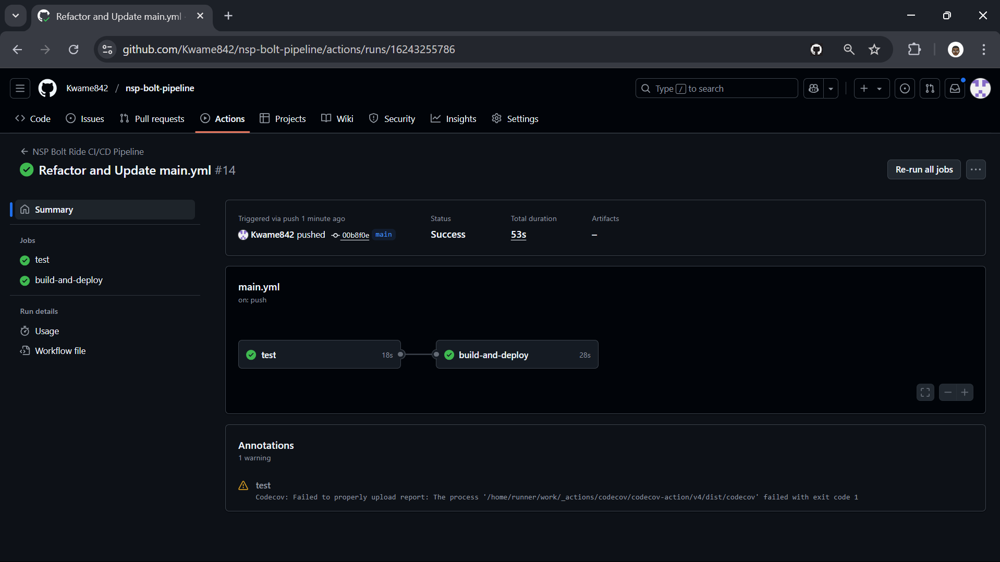
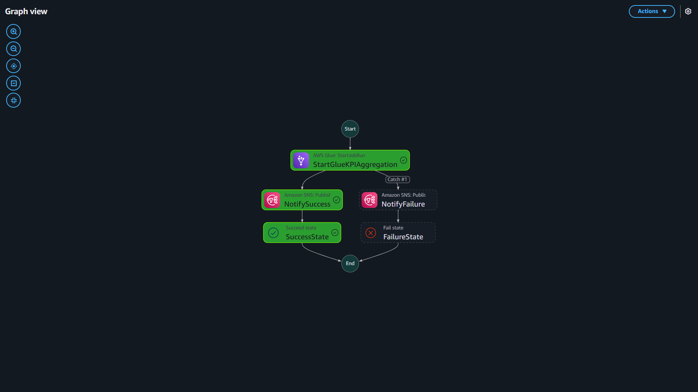
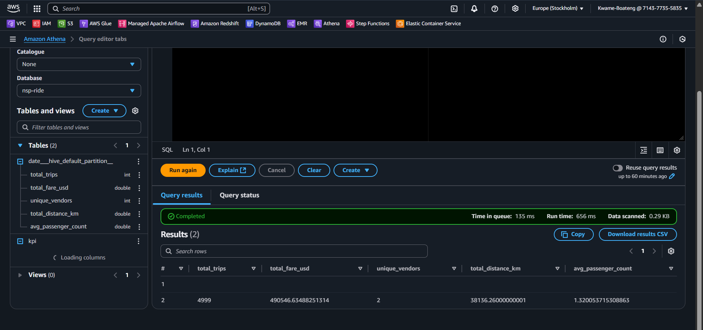
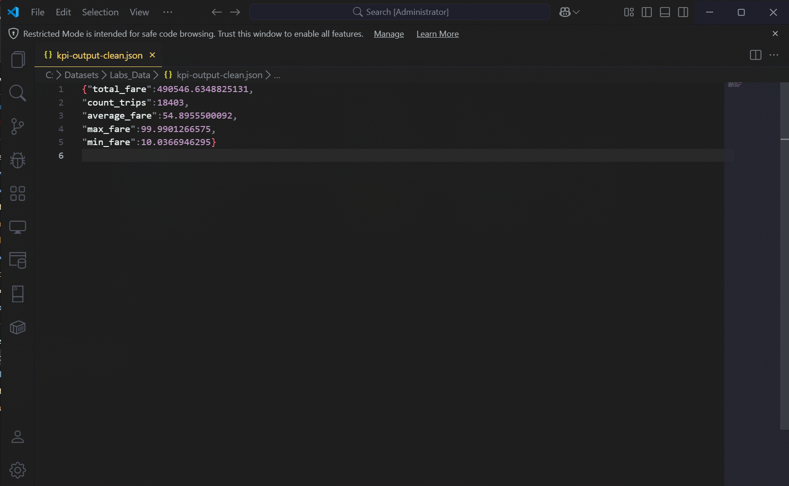

# NSP Bolt Ride – Real-Time Trip Processing Pipeline

The NSP Bolt Ride project is a scalable, serverless, and event-driven data processing pipeline designed to track and analyze ride-hailing trip events in real time. Built on Amazon Web Services (AWS), the pipeline ingests trip start and end events, validates and deduplicates data, detects trip completions, and computes daily key performance indicators (KPIs) such as total fares, average fare, and trip count. Results are stored in Amazon S3 for downstream analytics and reporting. The system leverages AWS Step Functions to orchestrate the daily KPI calculation process, ensuring reliability, modularity, cloud-native scalability, and fault tolerance. Core AWS services include Kinesis, Lambda, DynamoDB, Glue, S3, Step Functions, SQS, and CloudWatch.

This README provides a comprehensive guide to the project’s architecture, setup, deployment, and maintenance, catering to data engineers, DevOps professionals, and stakeholders interested in real-time data processing for ride-hailing applications.



---

## Table of Contents

1. [Project Overview](#project-overview)
   - [Goals](#goals)
   - [Key KPIs Tracked](#key-kpis-tracked)
2. [Architecture Overview](#architecture-overview)
   - [Components](#components)
   - [Data Flow](#data-flow)
3. [Project Structure](#project-structure)
4. [Prerequisites](#prerequisites)
5. [Deployment Instructions](#deployment-instructions)
   - [Step 1: Provision Infrastructure](#step-1-provision-infrastructure)
   - [Step 2: Deploy Lambda Functions](#step-2-deploy-lambda-functions)
   - [Step 3: Configure Event Triggers](#step-3-configure-event-triggers)
   - [Step 4: Deploy Step Functions State Machine](#step-4-deploy-step-functions-state-machine)
   - [Step 5: Schedule Step Functions Execution](#step-5-schedule-step-functions-execution)
   - [Step 6: Deploy Glue Job](#step-6-deploy-glue-job)
   - [Step 7: Test the Pipeline](#step-7-test-the-pipeline)
6. [Sample Output](#sample-output)
7. [Requirements](#requirements)
   - [Root Dependencies](#root-dependencies)
   - [Lambda Functions](#lambda-functions)
   - [Glue Job](#glue-job)
8. [Security & Best Practices](#security--best-practices)
9. [Monitoring & Logging](#monitoring--logging)
10. [Troubleshooting](#troubleshooting)
11. [FAQ](#faq)
12. [Contributing](#contributing)
13. [Author](#author)
14. [License](#license)

---

## Project Overview

### Goals

The NSP Bolt Ride pipeline is designed to process high-velocity ride-hailing trip data with the following objectives:

- **Real-Time Ingestion**: Capture trip start and end events in real time using Amazon Kinesis Data Streams.
- **Data Validation and Deduplication**: Ensure data integrity by validating event schemas and removing duplicates before storage in Amazon DynamoDB.
- **Trip Completion Detection**: Match trip start and end events to identify completed trips and update records accordingly.
- **Daily KPI Computation**: Aggregate completed trips daily to calculate KPIs (e.g., total fare, average fare, trip count, min/max fare) using an AWS Glue job orchestrated by AWS Step Functions.
- **Persistent Storage**: Store aggregated KPI results in Amazon S3 as timestamped JSON files for reporting, dashboarding, or further analytics.
- **Fault Tolerance and Monitoring**: Implement robust error handling with Amazon SQS dead-letter queues (DLQs) and comprehensive monitoring via Amazon CloudWatch.

### Key KPIs Tracked

The pipeline computes the following daily KPIs for completed trips:

- **Total Number of Completed Trips**: Count of trips with both start and end events.
- **Total Daily Revenue**: Sum of fares for all completed trips.
- **Average Trip Fare**: Mean fare across completed trips.
- **Minimum and Maximum Trip Fares**: Lowest and highest fares recorded for the day.

---

## Architecture Overview

### Components

The pipeline leverages a suite of AWS services to achieve scalability, reliability, and maintainability. Below is a detailed breakdown of each component:

| Component                  | AWS Service         | Purpose                                                                 |
| -------------------------- | ------------------- | ----------------------------------------------------------------------- |
| `trip-start-stream`        | Amazon Kinesis      | Ingests trip start events from external sources or the provided simulator. Supports high-throughput, real-time data streaming with configurable shards. |
| `trip-end-stream`          | Amazon Kinesis      | Ingests trip end events, decoupled from start events for independent scaling and processing. |
| `TripStartProcessor`       | AWS Lambda          | Validates trip start events against a JSON schema, deduplicates, and stores valid events in DynamoDB. |
| `TripEndProcessor`         | AWS Lambda          | Validates trip end events, matches with start events to detect trip completion, and updates DynamoDB records. |
| `TripData`                 | Amazon DynamoDB     | Stores trip records with `trip_id` as the partition key. Supports high read/write throughput with auto-scaling. |
| `daily_kpi_aggregator`     | AWS Glue            | Runs a daily ETL job to aggregate completed trips and compute KPIs, writing results to S3. |
| `KPIOrchestrator`          | AWS Step Functions  | Orchestrates the execution of the Glue job on a daily schedule, handling retries and error notifications. |
| `nsp-kpi-results-bucket`   | Amazon S3           | Stores KPI results as timestamped JSON files in a structured format for downstream analytics. |
| `TripDLQ`                  | Amazon SQS (DLQ)    | Captures failed Lambda events for debugging or manual retries, ensuring no data loss. |
| `CloudWatch Logs/Alarms`   | Amazon CloudWatch   | Logs all Lambda, Glue, and Step Functions executions; triggers alarms for errors or performance issues. |

### Data Flow

1. **Event Ingestion**: Trip start and end events are sent to separate Kinesis streams (`trip-start-stream` and `trip-end-stream`) from external sources or the provided `simulator.py`.
2. **Event Processing**:
   - `TripStartProcessor` Lambda validates start events, checks for duplicates, and stores them in the `TripData` DynamoDB table.
   - `TripEndProcessor` Lambda validates end events, queries DynamoDB for matching start events, marks trips as completed, and updates records.
3. **Trip Completion**: The `TripEndProcessor` ensures that only trips with both start and end events are marked as complete, handling edge cases like missing or out-of-order events.
4. **KPI Aggregation**: The `KPIOrchestrator` Step Function triggers the `daily_kpi_aggregator` Glue job daily at 00:00 UTC. The Glue job queries completed trips from DynamoDB, computes KPIs, and writes results to S3.
5. **Error Handling**: Failed Lambda events are routed to the `TripDLQ` SQS queue. Step Functions handles Glue job failures with retries and notifications.
6. **Monitoring**: CloudWatch logs all activities and triggers alarms for anomalies, such as high Lambda error rates or Glue job failures.

---

## Project Structure

The project is organized for modularity, maintainability, and ease of deployment. Below is the directory structure:

```bash
nsp-bolt-trip-pipeline/
├── .github/
│   └── workflows/              # GitHub Actions CI/CD configuration
│       └── main.yml            # CI/CD pipeline for testing and deployment
├── diagram/                    # Architecture diagrams
│   └── Architecture7.png       # Visual representation of the pipeline
├── lambdas/                    # Lambda function code and dependencies
│   ├── TripStartProcessor/
│   │   ├── TripStartProcessor.py  # Processes trip start events
│   │   └── requirements.txt       # Lambda-specific dependencies
│   └── TripEndProcessor/
│       ├── TripEndProcessor.py    # Processes trip end events
│       └── requirements.txt       # Lambda-specific dependencies
├── glue_jobs/                  # AWS Glue ETL job scripts
│   └── KPI-Aggregator.py       # Computes daily KPIs
├── step_functions/             # Step Functions state machine definition
│   └── KPI-Orchestrator.json   # Orchestrates Glue job execution
├── imgs/                       # Screenshots or additional visuals
│   └── screenshots.png         # Example dashboard or pipeline output
├── simulator/                  # Event simulator
│   └── simulator.py            # Generates mock trip events for testing
├── tests/                      # Unit and integration tests
│   ├── test_trip_start_processor.py
│   ├── test_trip_end_processor.py
│   └── test_kpi_aggregator.py
├── infrastructure/             # CloudFormation templates
│   └── template.yaml           # Defines AWS resources
├── README.md                   # Project documentation
└── requirements.txt            # Development dependencies
```

---

## Prerequisites

Before deploying the pipeline, ensure the following:

- **AWS Account**: An active AWS account with permissions to create and manage Kinesis, Lambda, DynamoDB, Glue, S3, Step Functions, SQS, and CloudWatch resources.
- **AWS CLI**: Installed and configured with credentials (`aws configure`).
- **Python**: Version 3.9 or higher for local development and testing.
- **IAM Roles**:
  - `StepFunctionsExecutionRole`: For Step Functions to trigger Glue jobs.
  - `GlueExecutionRole`: For Glue to access DynamoDB and S3.
  - `LambdaExecutionRole`: For Lambda to access Kinesis, DynamoDB, SQS, and CloudWatch.
- **GitHub Repository**: The project code pushed to a GitHub repository for CI/CD.
- **Secrets**: Store AWS credentials (`AWS_ACCESS_KEY_ID`, `AWS_SECRET_ACCESS_KEY`, `AWS_ACCOUNT_ID`) in GitHub Secrets for CI/CD.

---

## Deployment Instructions

Follow these steps to deploy the pipeline manually. For automated deployment, refer to the `.github/workflows/main.yml` CI/CD pipeline.



### Step 1: Provision Infrastructure

Deploy the AWS resources using the provided CloudFormation template.

```bash
aws cloudformation deploy \
  --template-file infrastructure/template.yaml \
  --stack-name nsp-bolt-trip-pipeline \
  --capabilities CAPABILITY_NAMED_IAM \
  --region us-east-1
```

- **Details**: The `template.yaml` defines Kinesis streams, DynamoDB table, S3 bucket, SQS DLQ, IAM roles, and CloudWatch alarms.
- **Verification**: Check the CloudFormation stack status in the AWS Console or via:
  ```bash
  aws cloudformation describe-stacks --stack-name nsp-bolt-trip-pipeline
  ```

### Step 2: Deploy Lambda Functions

Package and deploy the `TripStartProcessor` and `TripEndProcessor` Lambda functions.

```bash
# For TripStartProcessor
cd lambdas/TripStartProcessor
pip install -r requirements.txt -t .
zip -r9 ../trip_start_processor.zip .
aws lambda update-function-code \
  --function-name TripStartProcessor \
  --zip-file fileb://../trip_start_processor.zip \
  --region us-east-1

# For TripEndProcessor
cd ../TripEndProcessor
pip install -r requirements.txt -t .
zip -r9 ../trip_end_processor.zip .
aws lambda update-function-code \
  --function-name TripEndProcessor \
  --zip-file fileb://../trip_end_processor.zip \
  --region us-east-1
```

- **Details**: Each Lambda function is packaged with its dependencies into a ZIP file and uploaded to AWS Lambda.
- **Verification**: Confirm the function code is updated in the AWS Lambda Console.

### Step 3: Configure Event Triggers

Link the Lambda functions to their respective Kinesis streams.

```bash
aws lambda create-event-source-mapping \
  --function-name TripStartProcessor \
  --event-source-arn arn:aws:kinesis:us-east-1:<account-id>:stream/trip-start-stream \
  --batch-size 100 \
  --starting-position LATEST \
  --region us-east-1

aws lambda create-event-source-mapping \
  --function-name TripEndProcessor \
  --event-source-arn arn:aws:kinesis:us-east-1:<account-id>:stream/trip-end-stream \
  --batch-size 100 \
  --starting-position LATEST \
  --region us-east-1
```

- **Details**: Replace `<account-id>` with your AWS account ID. The `batch-size` of 100 optimizes throughput and latency.
- **Verification**: Check the event source mappings in the AWS Lambda Console.

### Step 4: Deploy Step Functions State Machine

Deploy the `KPIOrchestrator` state machine to orchestrate the Glue job.

```bash
aws stepfunctions create-state-machine \
  --name KPIOrchestrator \
  --definition file://step_functions/KPI-Orchestrator.json \
  --role-arn arn:aws:iam::<account-id>:role/StepFunctionsExecutionRole \
  --region us-east-1
```

- **Details**: The `KPI-Orchestrator.json` defines a state machine that triggers the `daily_kpi_aggregator` Glue job and handles retries/errors.
- **Verification**: Confirm the state machine is active in the AWS Step Functions Console.

### Step 5: Schedule Step Functions Execution

Create a CloudWatch Events Rule to trigger the Step Functions state machine daily at 00:00 UTC.

```bash
aws events put-rule \
  --name DailyKPIOrchestration \
  --schedule-expression "cron(0 0 * * ? *)" \
  --region us-east-1

aws events put-targets \
  --rule DailyKPIOrchestration \
  --targets "Id=1,Arn=arn:aws:states:us-east-1:<account-id>:stateMachine:KPIOrchestrator" \
  --region us-east-1
```

- **Details**: The cron expression `0 0 * * ? *` schedules the execution daily at midnight UTC.
- **Verification**: Verify the rule in the CloudWatch Console under Rules.



### Step 6: Deploy Glue Job

Upload the Glue script to S3 and create/update the Glue job.

```bash
aws s3 cp glue_jobs/KPI-Aggregator.py s3://nsp-kpi-results-bucket/glue_scripts/KPI-Aggregator.py \
  --region us-east-1

aws glue create-job \
  --name daily_kpi_aggregator \
  --role arn:aws:iam::<account-id>:role/GlueExecutionRole \
  --command "Name=glueetl,ScriptLocation=s3://nsp-kpi-results-bucket/glue_scripts/KPI-Aggregator.py" \
  --default-arguments '{"--TempDir":"s3://nsp-kpi-results-bucket/temp/","--job-language":"python"}' \
  --region us-east-1
```

- **Details**: The Glue job reads from DynamoDB, computes KPIs, and writes to S3. The `GlueExecutionRole` must have permissions for DynamoDB, S3, and CloudWatch.
- **Verification**: Check the Glue job in the AWS Glue Console.

### Step 7: Test the Pipeline

Use the provided simulator to generate test events.

```bash
cd simulator
python simulate.py
```

- **Details**: The `simulator.py` script sends mock trip start and end events to the Kinesis streams.
- **Verification**: Monitor DynamoDB for trip records, S3 for KPI outputs, and CloudWatch for logs.

---

## Sample Output

The Glue job generates daily KPI results in S3 as timestamped JSON files. Example output:

```json
{
  "date": "2025-07-11",
  "total_fare": 18123.5,
  "count_trips": 254,
  "average_fare": 71.35,
  "min_fare": 12.5,
  "max_fare": 103.75
}
```




- **Location**: `s3://nsp-kpi-results-bucket/kpi-results/YYYY/MM/DD/kpi.json`
- **Usage**: Suitable for integration with dashboards (e.g., Amazon QuickSight) or further analytics.

---

## Requirements

### Root Dependencies

For development and testing:

```txt
boto3==1.28.0
botocore==1.31.0
jsonschema==4.17.3
pytest==7.4.0
moto[dynamodb2]==4.1.0
```

### Lambda Functions

For `TripStartProcessor` and `TripEndProcessor`:

```txt
boto3==1.28.0
jsonschema==4.17.3
```

### Glue Job

For `daily_kpi_aggregator`:

```txt
boto3==1.28.0
decimal==1.70
```

- **Note**: Specific versions ensure compatibility. Update as needed, but test thoroughly.

---

## Security & Best Practices

- **Encryption**:
  - Enable server-side encryption (SSE-KMS) on S3 buckets and DynamoDB tables.
  - Use KMS keys for Kinesis stream encryption.
- **IAM Policies**:
  - Apply least privilege principles. Example: Lambda roles should only access necessary Kinesis, DynamoDB, and SQS resources.
  - Use AWS-managed policies like `AWSLambdaKinesisExecutionRole` where applicable.
- **Secrets Management**:
  - Store sensitive values (e.g., API keys, database credentials) in AWS Secrets Manager or Parameter Store.
  - Reference secrets in Lambda environment variables or Step Functions inputs.
- **Tagging**:
  - Tag all resources with `Project: NSP-Bolt-Ride` for cost tracking and management.
- **Versioning**:
  - Enable S3 bucket versioning to recover from accidental overwrites.
  - Use Lambda aliases for versioning and rollback.

---

## Monitoring & Logging

- **CloudWatch Logs**:
  - Lambda functions log validation errors, processing details, and exceptions.
  - Glue jobs log ETL progress and errors.
  - Step Functions logs execution states and failures.
- **CloudWatch Alarms**:
  - Set up alarms for:
    - Lambda error rates (`Errors` metric > 0).
    - Kinesis iterator age (`IteratorAgeMilliseconds` > 1,000,000 for delayed processing).
    - Glue job failures (`JobRunState` = FAILED).
    - Step Functions execution failures.
- **Dashboards**:
  - Create a CloudWatch Dashboard to monitor Kinesis throughput, Lambda duration, and Glue job runtime.

---

## Troubleshooting

| Issue | Possible Cause | Solution |
|-------|----------------|----------|
| Lambda fails to process events | Invalid event schema | Check CloudWatch logs for validation errors; update `jsonschema` rules in Lambda code. |
| Events in DLQ | Processing timeout or errors | Inspect `TripDLQ` messages; adjust Lambda timeout/memory or fix code bugs. |
| Glue job fails | Insufficient permissions | Verify `GlueExecutionRole` has access to DynamoDB and S3. |
| No KPI output in S3 | Step Functions not triggered | Ensure CloudWatch Events Rule is active and targets the correct state machine ARN. |
| High latency in Kinesis | Insufficient shards | Increase shard count in Kinesis streams via AWS Console or CLI. |

- **Logs**: Always check CloudWatch Logs first for detailed error messages.
- **Testing**: Use `simulator.py` to generate controlled test cases.
- **Support**: Contact AWS Support for persistent issues with service limits or configurations.

---

## FAQ

**Q: Why use two Kinesis streams?**  
A: Separate streams for start and end events decouple ingestion, simplify debugging, and allow independent scaling based on event volume.

**Q: How are missing events handled?**  
A: Trips without both start and end events remain incomplete in DynamoDB and are excluded from KPI calculations. A cleanup process can be added to handle stale records.

**Q: Why use Step Functions for the Glue job?**  
A: Step Functions provides robust scheduling, retry logic, error handling, and state tracking, ensuring reliable daily KPI computation.

**Q: Is this scalable?**  
A: Yes, the pipeline scales via:
  - Kinesis shard scaling for high-throughput ingestion.
  - Lambda auto-scaling for event processing.
  - DynamoDB auto-scaling for read/write capacity.
  - Step Functions for reliable orchestration.

**Q: Can I extend the pipeline?**  
A: Yes, add new Lambda functions for additional event types, extend the Glue job for more KPIs, or integrate with QuickSight for dashboards.

---

## Contributing

Contributions are welcome! To contribute:

1. Fork the repository.
2. Create a feature branch (`git checkout -b feature/new-feature`).
3. Commit changes (`git commit -m "Add new feature"`).
4. Push to the branch (`git push origin feature/new-feature`).
5. Open a pull request with detailed descriptions of changes.

Please include tests in the `tests/` directory and update documentation as needed.

---

## Author

Developed by Kwame A. Boateng

---

## License

This project is licensed under the MIT License. See the [LICENSE](LICENSE) file for details.
